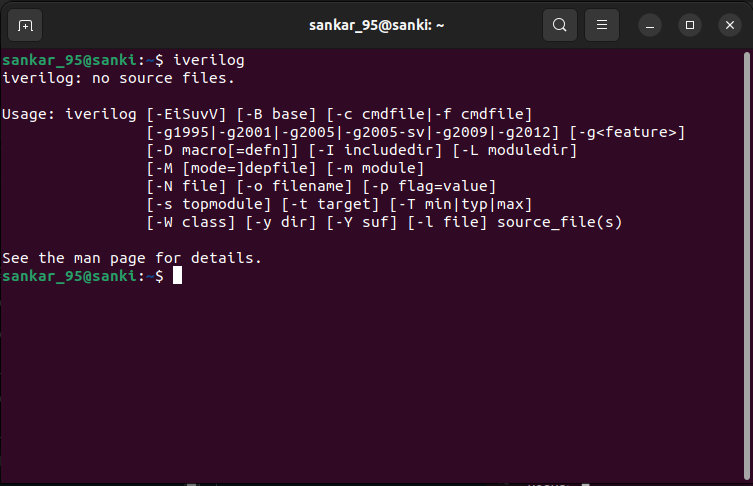

# ⚙️ Tools Installation – VSD Program Setup

<div align="center">


</div>

Welcome to the **Tools Installation Guide** for the **VLSI System Design (VSD) Program**.  
This section ensures that all the required tools and dependencies are properly installed to create a smooth workflow for RTL design, simulation, and layout.  

---

## 🖥️ **System Requirements**

To guarantee stable performance during synthesis, simulation, and layout design, ensure your system meets the following specifications:

<div align="center">

| **Specification** 💻    | **Requirement** 📋      |
|--------------------------|-------------------------|
| **Operating System** 🐧  | Ubuntu 20.04 or higher |
| **RAM** 💾               | 6 GB                   |
| **Storage** 💿           | 50 GB HDD              |
| **vCPUs** ⚡             | 4                      |

</div>

> 💡 **Pro Tip:** Allocating slightly higher resources (like 8 GB RAM) can further improve simulation speed and tool performance.

---

## 📂 **Installation Instructions**

All detailed steps for installing **Yosys, Iverilog, GTKWave, Ngspice, and Magic VLSI** can be found in the upcoming sections.  

Stay tuned for:  


### **TOOL CHECK**

#### <ins>**1.Yosys**</ins>
```bash
$ sudo apt-get update
$ git clone https://github.com/YosysHQ/yosys.git
$ cd yosys
$ sudo apt install make               # If make is not installed
$ sudo apt-get install build-essential clang bison flex \
    libreadline-dev gawk tcl-dev libffi-dev git \
    graphviz xdot pkg-config python3 libboost-system-dev \
    libboost-python-dev libboost-filesystem-dev zlib1g-dev
$ make config-gcc
# Yosys build depends on a Git submodule called abc, which hasn't been initialized yet. You need to run the following command before running make
$ git submodule update --init --recursive
$ make 
$ sudo make install
```


#### <ins>**2.Iverilog**</ins>
```bash
$ sudo apt-get update
$ sudo apt-get install iverilog
```



#### <ins>**3.gtkwave**</ins>
```bash
$ sudo apt-get update
$ sudo apt install gtkwave
```


#### <ins>**ngspice**</ins>
After downloading the tarball from https://sourceforge.net/projects/ngspice/files/ to a local directory, unpack it using:
```bash
$ tar -zxvf ngspice-37.tar.gz
$ cd ngspice-37
$ mkdir release
$ cd release
$ ../configure  --with-x --with-readline=yes --disable-debug
$ make
$ sudo make install
```


#### <ins>**magic**</ins>
Install the required dependencies:
```bash
$ sudo apt-get install m4
$ sudo apt-get install tcsh
$ sudo apt-get install csh
$ sudo apt-get install libx11-dev
$ sudo apt-get install tcl-dev tk-dev
$ sudo apt-get install libcairo2-dev
$ sudo apt-get install mesa-common-dev libglu1-mesa-dev
$ sudo apt-get install libncurses-dev
```
Clone and build Magic:
```bash
$ git clone https://github.com/RTimothyEdwards/magic
$ cd magic
$ ./configure
$ make
$ sudo make install
```


### <ins>**Tool Versions**</ins>
```bash
$ git --version
$ docker --version
$ python3 --version
$ python3 -m pip --version
$ make --version
```


## 🎉 **Installation Summary**

| Tool | Status | Primary Use |
|------|--------|-------------|
| 🧠 **Yosys** | ✅ Complete | RTL Synthesis |
| 📟 **Iverilog** | ✅ Complete | Verilog Simulation |
| 📊 **GTKWave** | ✅ Complete | Waveform Analysis |
| ⚡ **Ngspice** | ✅ Complete | Circuit Simulation |
| 🎨 **Magic VLSI** | ✅ Complete | Layout Design |
